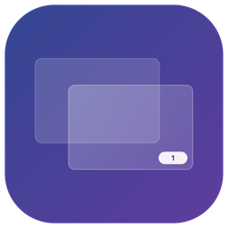
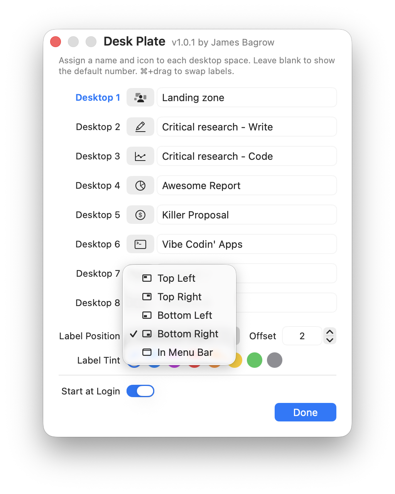
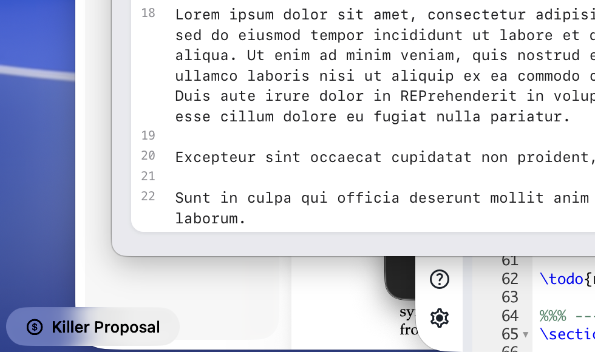

<p align="center">
  
</p>

# Desk Plate

A lightweight menu bar app that shows a floating label identifying your current desktop/space. Give your spaces memorable names to keep track of your work.
Built for macOS 26 (Tahoe).

<p align="center">
  
  
</p>


## Features

- **Floating glass label** overlay showing the current desktop name, rendered with Liquid Glass
- **Custom names** for each desktop space
- **SF Symbol icons** per desktop, chosen from a curated picker with 80+ icons across 9 categories
- **Flexible positioning** -- place the label in any corner or display it directly in the menu bar
- **Persistent settings** -- labels, icons, and position survive restarts

## Installation

```bash
make
```

This compiles all Swift sources, bundles the app, and ad-hoc codesigns it.

To build and install to `~/Applications`:

```bash
make install
```

### Requirements

- macOS 26 (Tahoe) or later
- Xcode Command Line Tools (for `swiftc` and the macOS SDK)

## Usage

- **Left-click** the menu bar icon to open the Edit Labels window
- **Right-click** the menu bar icon for the dropdown menu (position, quit)
- Assign a name and optional icon to each desktop
- Choose where the label appears: Top Left, Top Right, Bottom Left, Bottom Right, or In Menu Bar

    
## See Also

- [Spaceman](https://github.com/Jaysce/Spaceman) -- view your Spaces in the menu bar (also available as a [maintained fork](https://github.com/ruittenb/Spaceman))
- [DesktopRenamer](https://github.com/gitmichaelqiu/DesktopRenamer) -- rename macOS desktops/spaces, shown as a menu bar label
- [Spaces Renamer](https://github.com/dado3212/spaces-renamer) -- rename spaces directly in Mission Control (requires SIP disabled; Intel only)

## Author

James Bagrow

## License

[MIT](LICENSE) &copy; James Bagrow
